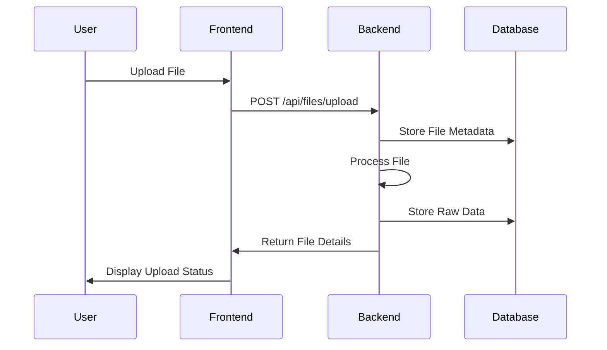
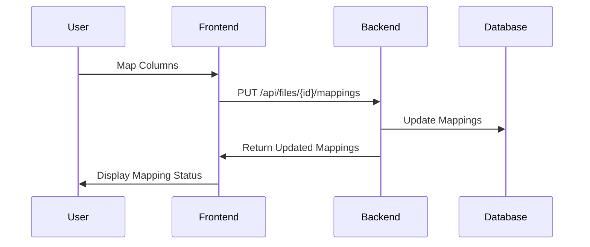
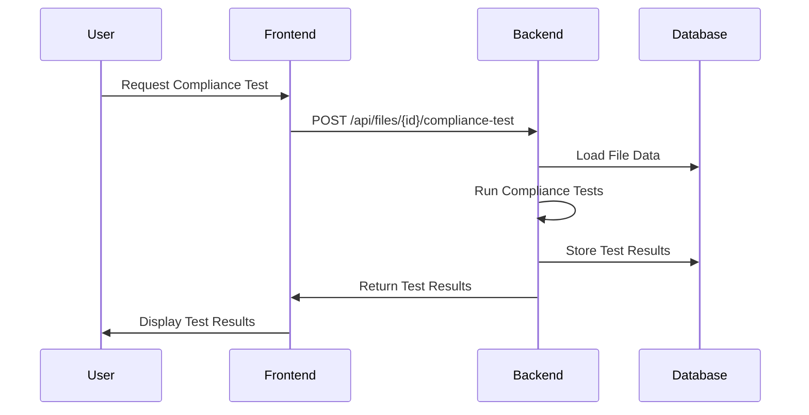

# KPlan Project Architecture

## Overview
KPlan is a full-stack web application designed for 401(k) plan data management and compliance testing. The system consists of a React frontend, FastAPI backend, and PostgreSQL database.

## Technology Stack

### Frontend
- **Language**: TypeScript/JavaScript
- **Framework**: React
- **Key Libraries**:
  - Axios for API communication
  - React Router for navigation
  - TypeScript for type safety
  - CSS Modules for styling

### Backend
- **Language**: Python 3.8+
- **Framework**: FastAPI
- **Key Libraries**:
  - SQLAlchemy for ORM
  - Pydantic for data validation
  - Alembic for database migrations
  - Pandas for data processing
  - psycopg2 for PostgreSQL connection

### Database
- **Type**: PostgreSQL
- **ORM**: SQLAlchemy
- **Migration Tool**: Alembic

## System Architecture

### Component Diagram
```
┌─────────────┐     ┌─────────────┐     ┌─────────────┐
│   Frontend  │     │   Backend   │     │  Database   │
│  (React)    │◄────┤  (FastAPI)  │◄────┤ (PostgreSQL)│
└─────────────┘     └─────────────┘     └─────────────┘
      │                   │                   │
      │                   │                   │
      ▼                   ▼                   ▼
┌─────────────┐     ┌─────────────┐     ┌─────────────┐
│  User       │     │  Business   │     │  Data       │
│ Interface   │     │  Logic      │     │  Storage    │
└─────────────┘     └─────────────┘     └─────────────┘
```

### Directory Structure
```
kplan-project/
├── frontend/                 # React frontend application
│   ├── src/
│   │   ├── components/      # React components
│   │   ├── services/        # API service layer
│   │   ├── types/          # TypeScript type definitions
│   │   └── App.tsx         # Main application component
│   └── package.json        # Frontend dependencies
│
├── backend/                  # FastAPI backend application
│   ├── app/
│   │   ├── api/            # API endpoints
│   │   ├── core/           # Core functionality
│   │   ├── models/         # Database models
│   │   ├── schemas/        # Pydantic schemas
│   │   └── utils/          # Utility functions
│   ├── main.py             # Application entry point
│   └── requirements.txt    # Backend dependencies
│
└── alembic/                 # Database migrations
```

## Business Logic Flow

### File Upload and Processing


### Column Mapping


### Compliance Testing


## Key Components

### Frontend Components
1. **FileUpload**: Handles file upload functionality
2. **ColumnMapper**: Manages column mapping interface
3. **ComplianceTestingWorkflow**: Manages compliance testing process
4. **Dashboard**: Displays system overview and statistics

### Backend Services
1. **FileService**: Handles file upload and processing
2. **MappingService**: Manages column mappings
3. **ComplianceService**: Executes compliance tests
4. **DatabaseService**: Manages database operations

### Database Models
1. **FileUpload**: Stores file metadata
2. **EmployeeData**: Stores processed employee data
3. **ColumnMapping**: Stores column mapping configurations
4. **ComplianceTestRun**: Stores compliance test results

## API Endpoints

### File Management
- `POST /api/files/upload`: Upload new file
- `GET /api/files/uploads`: List uploaded files
- `GET /api/files/{id}`: Get file details
- `PUT /api/files/{id}/mappings`: Update column mappings
- `POST /api/files/{id}/process`: Process file data

### Compliance Testing
- `POST /api/files/{id}/compliance-test`: Run compliance tests
- `GET /api/compliance/results`: Get recent test results
- `GET /api/compliance/history`: Get test history

## Security Considerations
1. File upload validation
2. Data sanitization
3. API authentication (to be implemented)
4. Database access control
5. CORS configuration

## Performance Considerations
1. File processing optimization
2. Database indexing
3. API response caching
4. Frontend state management
5. Batch processing for large files

## Future Enhancements
1. User authentication and authorization
2. Real-time compliance testing
3. Advanced data validation
4. Report generation
5. Integration with external systems 